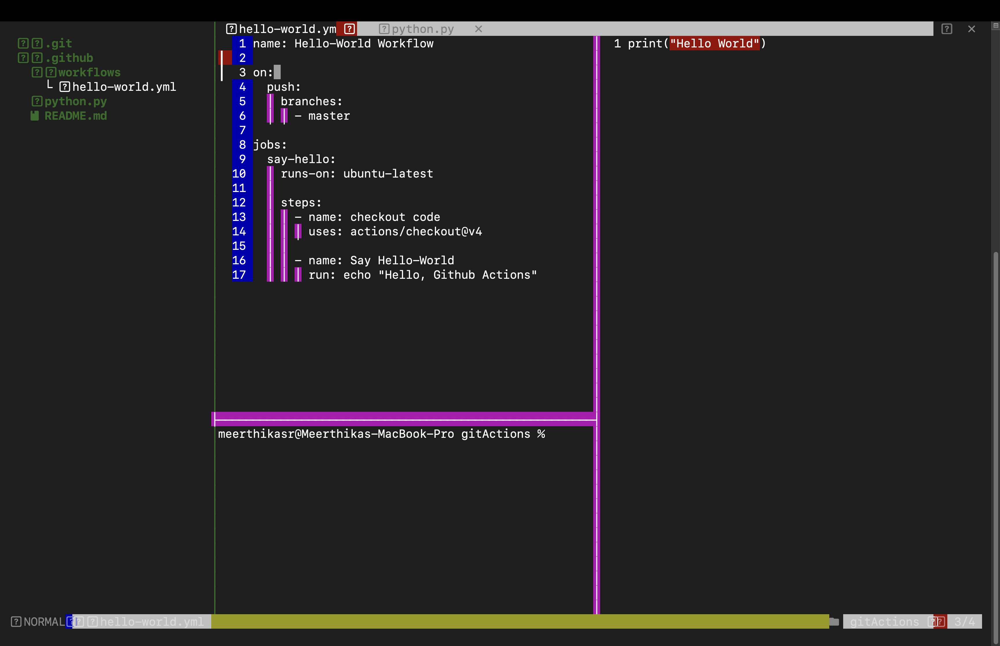

# GitActions Repository

This repository contains A simple code and configuration for automating workflows using GitHub Actions.

## Installation

To use the GitHub Actions in your own repository, follow these steps:

1. Clone this repository to your local machine:
   ```bash
   git clone https://github.com/your-username/gitactions.git


# **My NeoVim Setup :)**

```
Theme - NightOwl
```

